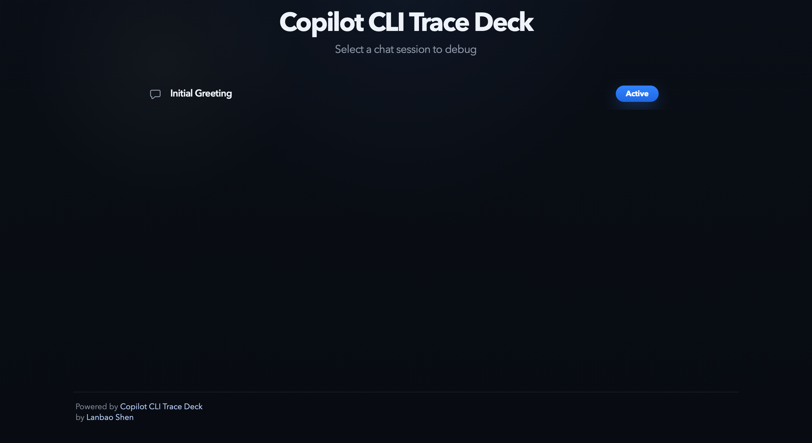
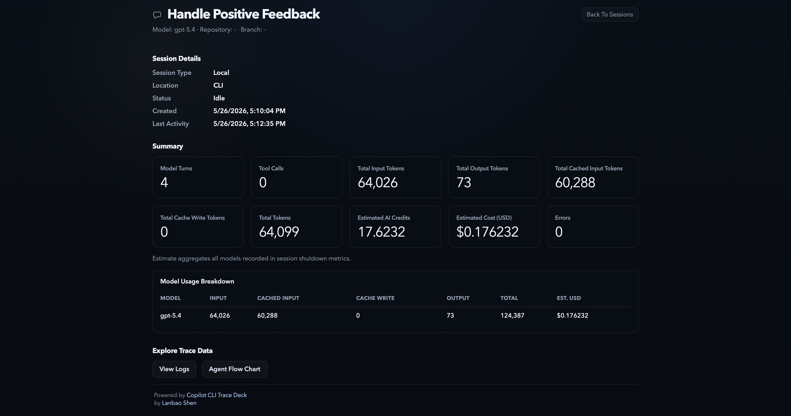
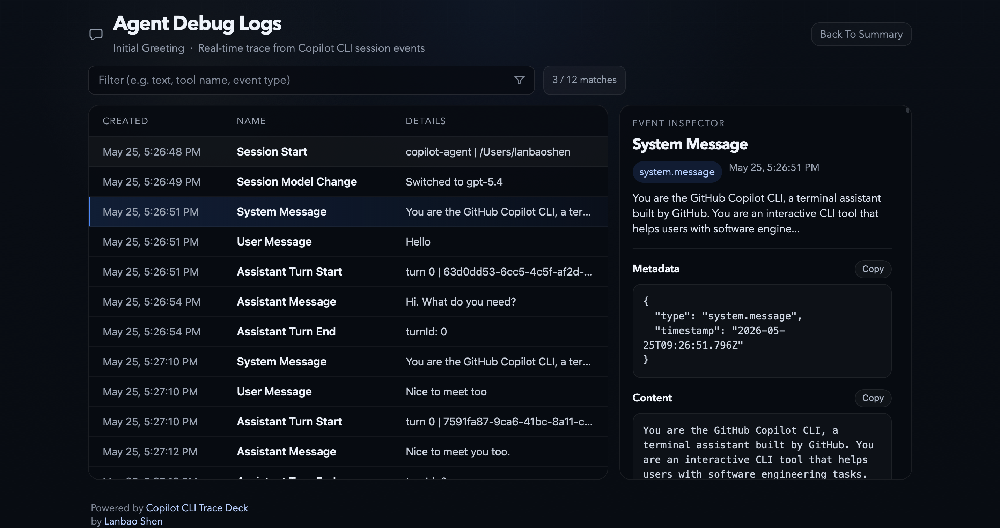
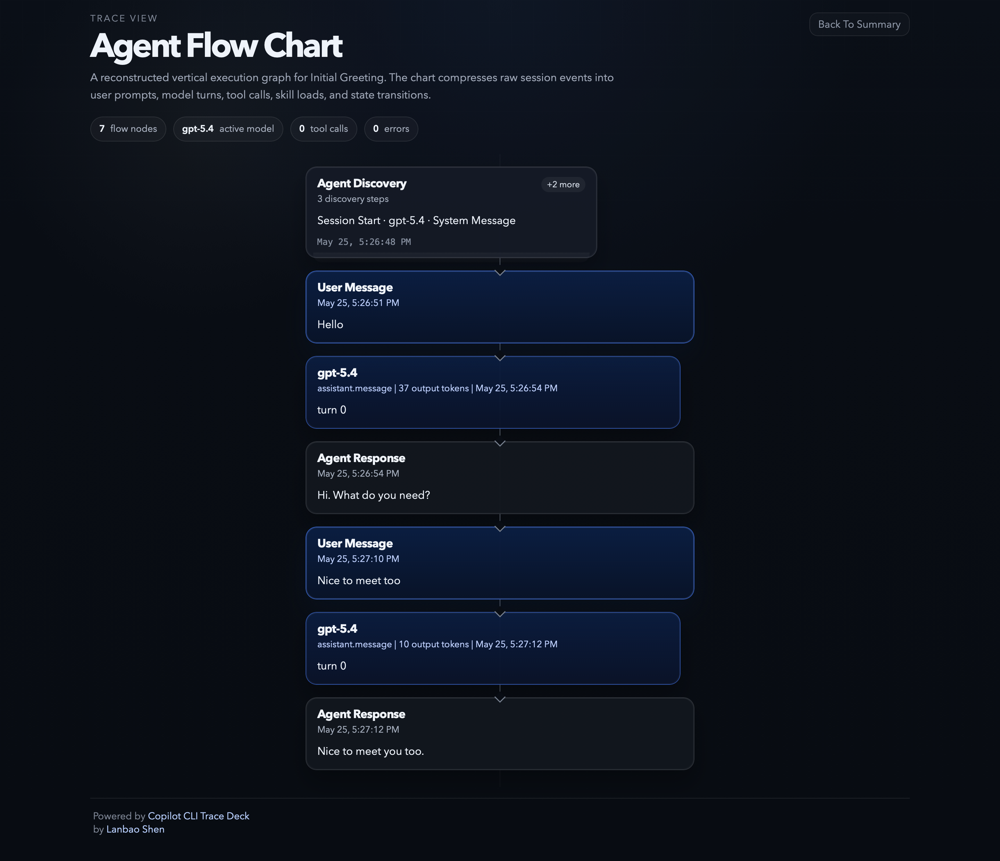

# copilot-cli-trace-deck
Render GitHub Copilot CLI agent debug logs into a clear, inspectable trace view.

## Screenshots

### Main View



### Summary View



### Log View



### Flow View



## Run

Run the app directly from the workspace with `uv`:

```bash
uv run copilot-cli-trace-deck
```

By default the server listens on `http://127.0.0.1:9887` and opens that URL in your browser.

Live updates are pushed over Server-Sent Events and triggered by file-system changes in the session-state directory, so the home, summary, logs, and flow pages update without browser polling.

The summary view also estimates per-session GitHub AI Credits / USD cost from shutdown metrics, aggregating token usage across model switches within the same session.

You can also pass the session-state source and server options:

```bash
uv run copilot-cli-trace-deck ~/.copilot/session-state --host 127.0.0.1 --port 9887
```

To skip opening a browser while still printing the local URL:

```bash
uv run copilot-cli-trace-deck --quiet
```

## Install As A Command

Install the project as a local tool and run it directly from your shell:

```bash
uv tool install .
copilot-cli-trace-deck --help
```
